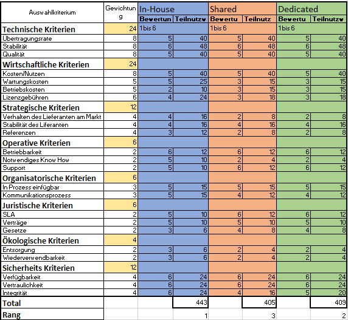
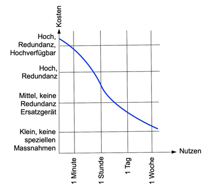

# 1. M146 - Portfolio

 
## Internetanbindung für ein Unternehmen realisieren.
## 17.09.2021 - 28.09.2021
 

Jonah Gutknecht Thomas Züger 
Technische Berufsschule Zürich  
Ausstellungsstrasse 70 Zurich, 8005  
Klasse: St19a  
Gruppennummer: 05  
Präsentationsthema: GNS 3  
Datum Präsentation: 28.09.2021   

# 2. Inhaltsverzeichnis <omit in toc>
- [1. M146 - Portfolio](#1-m146---portfolio)
  - [Internetanbindung für ein Unternehmen realisieren.](#internetanbindung-für-ein-unternehmen-realisieren)
  - [17.09.2021 - 28.09.2021](#17092021---28092021)
- [2. Inhaltsverzeichnis <omit in toc>](#2-inhaltsverzeichnis-omit-in-toc)
  - [Auftrag](#auftrag)
  - [Ausgangslage](#ausgangslage)
  - [Themen](#themen)
    - [Übertragungsrate, Verfügbarkeit](#übertragungsrate-verfügbarkeit)
    - [Wie viel bei Internen Server:](#wie-viel-bei-internen-server)
  - [WAN-Technologie](#wan-technologie)
    - [xDSL](#xdsl)
    - [Fibre (FTTH)](#fibre-ftth)
    - [Cable](#cable)
    - [Radiolink](#radiolink)
    - [Satellit](#satellit)
  - [Vergleich](#vergleich)
  - [Internet Services](#internet-services)
    - [Dedizierte Server (Root-Server):](#dedizierte-server-root-server)
    - [Services beim Provider (Shared Hosting):](#services-beim-provider-shared-hosting)
    - [Vergleich](#vergleich-1)
  - [Sicherheit](#sicherheit)
    - [ISO Reihe 27000](#iso-reihe-27000)
    - [Vertraulichkeit](#vertraulichkeit)
    - [Integrität](#integrität)
    - [Authentizität und Authentisierung](#authentizität-und-authentisierung)
    - [Zurechenbarkeit:](#zurechenbarkeit)
    - [Nicht-Abstreitbarkeit](#nicht-abstreitbarkeit)
    - [Verlässlichkeit](#verlässlichkeit)

 
 
## Auftrag
Sie untersuchen in Gruppen die unten aufgeführten Themen im Zusammenhang mit der Internetanbindung eines Unternehmens. Dazu sollen Sie zu jedem Thema:
-  Zu jedem Thema die Leitfragen bearbeiten. Neue Fachwörter erklären und Zusammenhänge möglichst in einer grafischen Darstellung visualisieren.
-  verschiedene Realisierungsmöglichkeiten (-Varianten) zeigen und erläutern.

Zu zwei Themen sollen Sie in der Gruppe:

- Vergleichskriterien bestimmen und damit die Realisierungsmöglichkeiten bewerten.
- Typische Einsatzfälle definieren, und aus deren Sicht mit möglichen Vergleichskriterien gewichten.

Sie werden die Erkenntnisse zu allen Themen in einer Dokumentation zusammenfassen und zusätzlich zwei Themen in einem Vortrag präsentieren.
 
Die Dokumentation soll im Sinne eines Leitfadens Ihre gesammelten Erkenntnisse, Empfehlungen und Varianten enthalten.
 
Zu zwei Themen soll auch eine Entscheidungstabelle erstellt werden und eine Entscheidungstabelle soll in der Präsentation vorgestellt werden. Für einen konkreten Einsatzfall sollen Sie zu einem Entscheid für eine bestimmte Variante kommen. 

## Ausgangslage
Ein Unternehmen hat einen veralteten Internetzugang mit einer Übertragungsrate von 50 Mbit/s im Download und 5 Mbit/s im Upload mit ADSL. Die Firma produziert Kaffeemaschinen in einer städtischen Gegend in der Schweiz. Das Marketing nutzt moderne Webapplikationen mit viel Multimedia Anwendungen und ein Shop für Endkunden ist ebenfalls vorhanden. Alle Mitarbeitenden benutzen Mail und Browser Applikationen. Die Firma hat 120 Internetnutzer. Eine Firewall ist nicht vorhanden und die Server stehen alle beim Provider.

## Themen
### Übertragungsrate, Verfügbarkeit

Da die Server momentan noch bei dem Provider sind, müsste man die Internet Leitung auf
250- 500Mbit/s Kupfer aufbessern. Pro User sollten mindestens 2Mbit/s verfügbar sein. Da aber nicht alle User zur gleichen Zeit online sind, bekommt jeder User sowieso mehr. Für den Mail Verkehr empfiehlt es sich, den Upload Bereich gleichzusetzen.
Vor allem im Downloadbereich. Da die Kommunikation vom Provider aus zur Firma stattfindet.

### Wie viel bei Internen Server:

 Bei internem Server sollte die Internet Leitung so ausgelegt sein, dass eine Ausfallsicherheit vorhanden ist. Zum Beispiel, Dual Provider Lösung (2 Internet Anbieter [z.B. Leitung von Swisscom und von Sunrise]) oder ein Provider mit Ausfallsicherheit (z.B. Mobile oder DSL Backup). Ein gutes SLA ist ein grosses Plus für den eigenen Betrieb. Somit können Ausfälle innert kürzester Zeit behandelt werden. Der Provider sollte zudem eine 24/7H Hotline zur Verfügung stellen.

1. Fall 1, Ausfall von 10h:  
Die Leitung sollte so gewählt werden, dass die Ausfallszeit nicht grösser als 8h sein sollte, somit hat der Kunde 2 Stunden Reserve, falls es der Provider die Störungsbehebung innert 8h nicht zum Laufen schafft. Sobald es über die 10h Grenze gelingen würde, würde das Geschäft Schäden davontragen.

2. Fall 2, Ausfall von 4h:  
Bei diesem Case verschärft sich die Lage betreffend der Verfügbarkeit. Die Verfügbarkeit muss so gewählt werden, dass der Provider innert 2h das Problem bereits beseitigt haben sollte. Somit hat der Kunde immer noch 2H auf Reserve.  Hier sollte in Betracht gezogen werden, die Leitung mit Redundanz oder mit zusätzlichem Backup aufzubauen.
Somit kann der Kunde bei grösserem Ausfällen, welche nicht in 4H behoben werden können, sich immer noch auf die Redundanz-Lösung verlassen.

 
Provider:
- Swisscom
- Sunrise
- UPC
- Solnet
- Init7  
In diesem Falle ist unserer Meinung nach die Swisscom mit dem Produkt «IP Plus Business Internet Service» am besten geeignet.
 

Begründung für Unser Entscheid:
* Wählbare Verfügbarkeit Optionen und Service Levels. Stellen eine Hohe Verfügbarkeit zur Verfügung.
* Garantierte Symmetrische Bandbreiten bis zu 10 Gbit/s auf Glasfaser.
* Möglichkeit für ein Mobile Backup
* Service Down Time Frei wählbar,  
	* SDT4= Störungsbehebung innert 4H
    * SDT1 Light= Störungsbehebung innert 1h (Router Redundanz vorhanden)
  * SDT1= Störungsbehebung innert 1h (Router Redundanz vorhanden + getrennte Wegführung [2te Abgetrennte Leitung])
  *  Störungsannahme, 24/7 Hotline
   * Proaktive Überwachung des Backbones
    * Supportzeite in in 3 Ausprägungen:
      * Standard Support= Mo-Fr 07:00-18:00
      *  Extended Support= Mo-Sa 06:00-22:00
      * Full Support= 7 x 24H
      *  Möglichkeit für eine Störungsbehebung ausserhalb der Supportzeiten (Kostenpflichtig)         	
      *  Auslastungsstatistik im Kundencenter ersichtlich.
                           	
Bei diesem Produkt ist zudem noch eine Dual Provider Solution möglich.
 
Somit kann die Leitung an die exakten Bedürfnisse des Kunden angepasst werden, wie z.B an die Arbeitszeit und die Ausfalllänge. 

 
 
## WAN-Technologie
### xDSL
xDSL ist eine Sammelbezeichnung für ADSL, HDSL, SDSL, SHDSL, UDSL und VDSL.

Vorteile: 
Mit vDSL hat man eine tiefe Latenzzeit. Man hat auch mehrere Anwendungsmöglichkeiten, wie zum Beispiel UHD Fernseher, HD-(Video) Telefonie. Es ist eine gute Alternative für Geschäftskunden. Als zweite Lösung ist vDSL nicht die schlechteste Wahl. Im Ausbau ist es billiger als Glasfaser. 

Nachteile: 
Im Vergleich zu DSL hat es eine tiefere Verfügbarkeit. vDSL ist ungefähr 10 – 20 % teurer als DSL. Für VDSL braucht man spezielle VDSL-Router und VDSL Modems. Man muss dafür extra noch dafür das kaufen. Bei grosser Entfernung sinkt die Leistung zum DSLAM stark ab. 

 

### Fibre (FTTH)
Vorteile: 
Ein grosser Vorteil gegenüber allen anderen Technologien ist, das FTTH auch die Leistung erbringt, die man bezahlt. Der Up- und Downstream sind symmetrisch das heisst, dass man zum Beispiel 500 MB/s Downstream hat und auch 500 MB/s Upstream. Glasfaser hat auch eine höhere Stabilität, da man nicht beeinträchtigt ist, ob der Nachbar etwas herunterlädt. Bei anderen Technologien spielt das eine Rolle, ob der Nachbar etwas herunterlädt, dann ist die Bandbreite tiefer.
Nachteile: 
Glaskabel hat einen sehr grossen Nachteil, da wenn das Kabel etwas beschädigt wird zum Beispiel, wenn man es knickt dann sind die Glasfaser gebrochen und man wird nicht mehr auf die Leistung kommen, die man eigentlich gewohnt ist. Gegenüber Radiolink hat Glasfaser eine kleine Verzögerung. Das ist ein Grund warum bei den Börsen Frankfurt am Main und London auf Radiolink zurückgegriffen wird.

 

### Cable
Vorteile: 
Cable hat eine sehr hohe Bandbreite, die Geschwindigkeit kann sogar mit DSL konkurrieren. Über grosse Distanz verliert die Technologie wenig an Bandbreite. Damit ist die Geschwindigkeit nicht abhängig von der Distanz.

Nachteile: 
Alle die Cable haben hängen an einem Cluster. Das heisst, wenn der Nachbar eine 1 GB Datei herunterlädt habe ich weniger Bandbreite zur Verfügung da er etwas herunterlädt. An diesem Cluster ist nicht nur mein Nachbar, sondern auch viele andere in der Umgebung. Je nach Hausinstallation muss man Änderungen im jeweiligen Haushalt Netz vornehmen. Bei alten Gebäuden könnte dies schwierig gestalten, da die Kabel von dazumal nicht mehr den Standards entsprechen.

 

### Radiolink

Vorteile: 
Bei Richtfunk hat man keine Verzögerung, da es wird alles über Echtzeit übertragen. Keine andere Technologie überträgt die Daten in Echtzeit. Mit dieser Technologie kann man grosse Distanzen überbrücken. Richtfunk ist eine kostengünstige Technologie. Man kann es mit kleinem Budget die Technologie in Betrieb nehmen. Die grösste Ausfallsicherheit hat Radiolink.

Nachteile:  
Wenn, man diese Technologie in der Nähe von Flughäfen einsetzen möchte, muss man sich das nochmals überdenken. Da der Radiolink das Anflugradar stören kann. Wenn, zwei verschiedene Haushalte die gleiche Frequenz verwenden kann es zu Problemen kommen und die Datenpakete kommen nicht mehr an. 

 

### Satellit

Vorteile:  
Es wird kein fester Standort benötigt. Wenn, man den Ort viel ändert, ist es die beste Wahl. Deswegen haben auch Flugzeuge und Schiffe es eingebaut. Die einzige Bedingung ist, dass der Nutzer im Radius des Satelliten ist. Die bestehende Internetverbindung kann auch zum Telefonieren genutzt werden. Das ist praktisch, wenn man auf hoher See ist und kein Netz mehr hat.
 
Nachteile:  
Ein grosser Nachteil ist die Geschwindigkeit. Im Vergleich zu anderen Technologien ist es sehr langsam. Dazu kommt, das mit den Latenzen zwischen 500ms und 700ms eine grosse Verzögerung hat. Im Vergleich, ein Modem hat eine Latenz von 150-200ms. TCP ist nicht für so eine hohe Latenz ausgelegt. Da ein Slow Start die Datenübertragungsrate nicht sehr erhöht. 

## Vergleich
Alle Technologien haben seine Vorteile, manche haben mehr und manche weniger. FTTH ist für einen fixen Standort am besten, solange man nicht die Daten in Echtzeit übertragen muss. Wenn, man kein Börsenunternehmen ist und einen fixen Standort hat und nicht immer den Ort wechselt, ist FTTH die beste Lösung. Wenn man aber ein Börsenunternehmen ist, muss man auf Radiolink setzen, da Radiolink die einzige Technologie ist, die ohne Verzögerung Daten übertragen kann. Aber man darf das Unternehmen nicht zu nahe an einem Flughafen haben, da die Flugzeuge gestört werden können. Wenn man den Standort ständig ändert, wie auf dem Meer oder an sehr abgelegenen Orten der Welt, wäre die Satelliten Technologie nicht die schlechteste Wahl, da die Satelliten überall einsetzbar wären und zugleich kann man über die gleiche Leitung telefonieren. Kabel Internet ist praktisch, wenn man zu Hause nicht noch mehr Geld fürs Internet investieren will. Wenn, man wenig Internet braucht, lohnt es sich nicht auf FTTH upzugraden. 

Die Hauptlösung ist unterschiedlich, da die Unternehmen verschiedene Prioritäten haben.Deswegen ist kann man nicht so einfach pauschal zu sagen, was am besten die Backup Lösung ist. Wenn man einen fixen Standort hat würde ich auf Cable setzen, da 

Bei einem Mobilen standort würde ich Satellit als backup Lösung nehmen. Bei den Mobilen Standorten muss man selten grosse Dateien hin und her schicken.Bei abgelegenen Orten ist man alleine und muss nicht mit vielen die Bandbreite teilen. 

Die höchste Ausfallsicherheit haben DSL, Kabel und Satellitenfunk. Das kann man aber nochmals verbessern, indem man zum Beispiel DSL und Kabel miteinander kombiniert. Die Ausfallsicherheit wird nie 100% sein, aber man hat es auf das minimum reduziert. Je näher man auf die 100% zu steuert desto mehr Geld für wenige 0.1% in die Hand nehmen. 

   
  
  
## Internet Services
3.1 Eigener Server (Inhouse):
Vorteile:
Vorteile: Volle Kontrolle über den Server, Günstiger Speicherplatz, einmalige Kosten bei der Beschaffung der Hardware, Volle Verantwortlichkeit über die Daten/Inhalte.

Nachteile:  
Wartung, Stromzufuhr muss auf eigenes Risiko gewährleistet sein (z.B bei Stromausfall). Man ist selbst für die Redundanz bei Strom, Internet und Hardware verantwortlich.
Volle Verantwortlichkeit über die Daten/Inhalte, Man muss sich selbst um das Backup-Konzept kümmern. Man muss schauen welche Hardware am Ende wirklich benötigt wird.
 
Text:
Bei On-Premise-Lösungen sind die Investitionskosten zu Beginn hoch, zumal Leistungsreserven beim Server miteinberechnet werden müssen. Darüber hinaus müssen die laufenden Ausgaben für Wartung, Hardware und IT-Personal miteingerechnet werden. Mit der Abschreibung sinken die Kosten aber im Verlauf des System-Lebenszyklus.
Unternehmen, die vor Ort hosten, können Änderungen im Setup unabhängig und selbstständig implementieren, sofern sie Fachleute dafür haben. Sie sind jedoch auch für alle Software-Upgrades und notwendige Systemerweiterungen selbst zuständig. Bei Inhouse Servern muss bei der Anschaffung die Dimensionierung sehr wohl überlegt werden und die Optionen für einen weiteren Ausbau zu späterem Zeitpunkt ist ein wichtiges Auswahlkriterium.
Unternehmen haben mehr Kontrolle über die Implementierung, es dauert jedoch oft länger, bis der Server seinen Betrieb aufnehmen kann (Aufbau und Beschaffung des Systems).
Bei Inhouse Servern ist die Organisation selbst für die Sicherheit zuständig. Das bedingt Fachleute, die ein den Anforderungen entsprechendes Business-Continuity- und Disaster-Recovery-Management aufsetzen. Dennoch sind Inhouse-Standorte in Katastrophensituationen meist anfälliger für Datenverlust (Brand+Wasser Schäden, das Backup muss zudem an einem 2ten Sicheren Standort aufbewahrt werden)
Aber kritische Daten bleiben im Haus und sind immer unter eigener Kontrolle. Für den Zugriff auf die Daten ist das Unternehmen nicht auf eine funktionierende und genügend schnelle Internetverbindung angewiesen

 
 
 
### Dedizierte Server (Root-Server):
 
Vorteile: 
Provider ist verantwortlich für Hardware, grosse Ausfallsicherheit (die Redundanz bei Strom, Internet und Hardware ist meistens vorhanden [je nach Angebot], Support, Höchste Flexibilität in der Zusammenstellung der Server nach Kunden Bedarf. Speicherplatz innert wenigen Minuten und in beliebiger Menge beziehen. Umfangreiche Netzwerkfunktionen (Firewalls, Load Balancer, interne Netze) nutzen. Bedarf jederzeit anpassbar, inkl. Minutengenauer Abrechnung. Eigene Programme können installiert werden. Servereinstellungen können an die eigenen Bedürfnisse bestmöglich angepasst werden
 
Nachteile: 
Bei Ausfällen ist man auf den Provider angewiesen. Die Kosten sind monatlich höher als ein Hauseigener Server. Über die Jahre hinweg bezahlt man mehr als für den eigenen Server. Der Server kann nur für einen bestimmten Zweck benötigt werden.
 
Text:
Bei einem Dedicated Server handelt es sich um einen Server, der nur für einen bestimmten Zweck vorgesehen ist. Somit kann die komplette Leistung des Servers für die gewünschte Aufgabe verwendet werden.
Ein Server wird in der Regel bei einem Provider, wie zum Beispiel 1&1 oder Strato, angemietet. Dieser Server lässt sich dann unter anderem als Proxy- oder Web-Server nutzen.
Handelt es sich um einen Dedicated Server, wird dieser Server mit seiner kompletten Hardware nur von einem Kunden verwendet. Mieten Sie bei Angeboten einen Server für wenige Euro pro Monat, ist das meist nur möglich, da es sich dabei nicht um einen Dedicated Server handelt. Bei einem Dedicated Server ist man nur für das Betriebssystem und die Applikationen verantwortlich.
Quelle: Dedicated Server
 

### Services beim Provider (Shared Hosting):
Vorteile: 
Freischaltung innert kurzer Zeit, man bezahlt kleine monatliche Kosten (man zahlt schlussendlich für das Abo/Dienst den man gewählt/benötigt hat), Updates werden vom Provider automatisch aufgeschaltet, Die Sicherheit der Plattform liegt in der Verantwortlichkeit des Providers. Fix fertige Lösungen werden vom Provider bereitgestellt.
Bei solchen Angeboten (auch bekannt als: Shared Host) werden oft von mehreren Kunden verwendet, die sich somit die Leistung von einem Server teilen müssen.
 
Nachteile: 
Bei Ausfällen ist man auf den Provider angewiesen. Kein Zugriff auf Plattform, Upgrades auf dem Hosting werden durch den Provider bestimmt (in der Regel: keine Einflussnahme durch einzelne Kunden), Bandbreiten Begrenzung durch den Provider oder durch andere User. Bei bestimmten Angeboten kann Limitierter Speicherplatz zum Problem werden.
 
 
Text:
Beim Shared Hosting hat man folgende Pflichten nicht:
Die Aktualisierung und Instandhaltung des Servers und der installierten Software-Komponenten fällt komplett in den Aufgabenbereich des Providers. Da er aber auch dafür sorgen muss, dass alle Parteien ausschließlich Zugriff auf den eigenen Webserver und Webspace haben, sind die gewährten Zugriffsrechte anders als beim Dedicated Hosting deutlich eingeschränkt. Software-Installationen oder Änderungen an zentralen Serverkonfigurationen können daher nur durch den Anbieter selbst durchgeführt werden, wobei Sie zu diesem Zweck immer zunächst mit diesem in Kontakt treten müssen, was kurzfristige bzw. spontane Anpassungen unmöglich macht.
 
Beste Lösung für den Kunden:
Für diese Firma ist der Dedicated Server die beste Wahl, da bei diesem der Provider sich um das meiste kümmert, wie z.B. um die Ausfallsicherheit des Servers und Redundanz. Obwohl die Kosten bei der Hardware höher liegen, dürfen die Kosten der Redundanz nicht aus Betracht gelassen werden. Trotz den erhöhten Kosten muss sich der Endkunde um fast nichts kümmern.
Das Backup-Konzept ist kann meist 2fach vorhanden sein, einmal beim Provider und zusätzlich kann eine Kopie der Daten beim Kunden hinterlegt werden. 
 
### Vergleich

 
 
## Sicherheit
### ISO Reihe 27000
Die ISO Reihe 27000 gibt einen allgemeinen Überblick über die informations-Sicherheit der Mgmt Systeme. Hier befinden die grundlegende Prinzipien, Konzepte, Begriffe und Definitionen für ISMS (Information Security Management System).

Bei der Sicherheit wird die Frage nach der Verfügbarkeit gestellt. Systeme und Rechenzentren können mit verschiedenste attacken angegriffen werden wie durch einen Denial of Service (DDOS) Attack. Die ISO 27000 beschäftigt sich genau in diesem Fachbereich. Jedoch sollte man vor Beginn des Aufbaus eines Hoch Redundantes System eine Checkliste durchführen. Anhand dieser Checkliste kann genau ermitteln, wo und welches System mit welcher Priorität eingestuft werden muss.

  
Anhand dieser Grafik kann man seine Systeme einstufen. Hier werden zum Beispiel Finanzdienstleister ganz oben links bei der Kurve eingestuft und kleine Coiffeur Betriebe ganz unten Recht in der Kurve. 

### Vertraulichkeit
Bei der Vertraulichkeit geht es um den Schutz von sensiblen Daten im Betrieb. Dies werden meisten mit “Public”, “Internal”, “Confidential” und “Secret vermerkt” Public sind diese Daten, die jeder im Netz sehen darf, also diese die schon Zum Beispiel auf einer Website zu sehen sind. Internal sind Daten, die nur Mitarbeiter vom selben Betrieb sehen dürfen. Dies können Dokumentationen, Anleitungen oder auch Kundenaccounts. Confidential sind dann schon sehr strenge Dokumenten wie Offerten, die auf keinen Fall bei der Öffentlichkeit bekannt sein dürfen. Secret Dokumente sollen sehr Geheim und in einem sehr kleinen Radius verteilt werden. Diese sind dann Geschäftskritische Daten wie Rezepte oder Bilanzen. 

### Integrität
Bei der Integrität geht es darum, wer auf welche Daten oder System Zugriffe haben sollte. Zum Beispiel dürfen Personen aus dem Kaufmännischen Bereich kein Zugriff auf Administratoren Konten oder gar auf Jumpservers haben. So könnten diese Zugriffe missbraucht werden und dies könnte dem Betrieb viel Geld und Zeit kosten. Deswegen soll man sich immer zuerst die Fragen stellen wenn es um den Zusammenhang mit den Internetanbindungen von Firmen geht:

* Wie viele Mitarbeiter müssen darauf Zugriff haben?  
* Arbeiten auch Externe Personen damit?  
* Welche Zugriffe haben Externe (VPN)?

### Authentizität und Authentisierung
Netzwerkfähige Geräte sollten immer mit starken Passwörtern gesichert sein. Es muss immer klar sein, wer und wieso hat Zugriffe auf solche Systeme oder Geräten. Zudem muss man sich bei der Authentisierung diese Frage überlegen:

* Welches Verfahren soll zum Einsatz kommen? 1,2 oder 3 Stufiges Konzept?
* Sind Biometrische Daten auch erwünscht? (BSP: Physische Datacenter Zugriff)  

### Zurechenbarkeit:
Dateien, Mails und Briefe sollen immer einem Owner gewährleistet sein. So können bei Fragen und unklarheiten dieser Owner angefragt werden. Dieser Owner ist auch für die Annahme oder ABlehnung von Berechtigungen auf seine Dateien zuständig. Mails sollen zudem auch immer signiert werden. 

### Nicht-Abstreitbarkeit
Dieses Sicherheitsanforderung gilt an Web-Shops. Aus Sicht der Internetanbindungen soll man sich fragen, ob ein Webshop im Einsatz ist und ob Bestellungen via Mail oder via des WEB erfolgen. Dies muss man dokumentieren. 
### Verlässlichkeit
Die Verlässlichkeit spielt eine grosse Rolle mit der Wartung der Internetzugänge. Daher müssen folgende Fragen gestellt werden:

* Wie ist die Wartung organisiert?
* Sind die Systeme zuverlässig gewartet?
* Werden Backups gemacht?
* Werden Patches regelmässig eingespielt?
* Ist PKI (Public key Infrastructure) im Einsatz?
* Werden die Vulnerabilitäts Datenbanken regelmässig konsultiert?
* Werden ihre Firewalls intern oder extern gemanaged?
* Ist der BSI Grundschutz implementiert?

4.1.7 Zugriffskontrolle
Bei der zugriffskontrolle geht es nicht nur um physische Berechtigung sondern auch um das surfen im Internet. Auf welche Dienste und Webseiten sollen die Mitarbeiter der Firmen zugriff haben und wie lange? Diese Regeln müssen dann überwacht und überprüft werden. 
Zudem soll man jeden Dienst und Ort und die Zugriffsart gut dokumentieren. 
 
4.2 Sicherheitskonzept
4.2.1 Technische Massnahmen
●	Servers müssen durch einen USV Stromzufuhr betrieben werden. 
●	Physischer Zugriff für in den DC muss über Biometrisches Verfahren gehen.
●	Internetleitungen müssen Redundant sein.
●	Auf Netzwerkfähige Geräte im Serverraum wie Router und Switches, muss ein sicheres admin Passwort gesetzt werden.
●	Router muss Redundant sein
●	Bei den Servern müssen sichere BIOS und Admin Passwörter gesetzt werden. 
●	Webserver sollen in einem DMZ stehen und über einen Jump Server erreichbar sein.
●	Wenn Externe Mitarbeiter auf den Servers oder Datenbanken zugriff haben sollen, muss ein sicherer VPN eingesetzt werden
●	Differentials Backup müssen Täglich vom System gemacht werden.
 
4.2.2 Nicht Technische Massnahmen
●	Abgeschlossener Bereich für den Serverraum
●	Offene Switches müssen in einem Kasten / Schrank abgeschlossen werden
●	Vendor Escalation für wichtige Systeme / Server müssen genau dokumentiert werden
●	Pikett Dienst muss durchgeführt und dokumentiert werden.
●	Bei jeder Berechtigungsart muss ein Owner definiert und dokumentiert werden.
●	Genaue Dokumentation über zugriffskontrollen auf den Servern müssen laufend gemacht werden.

 
1. Wartung / Überwachung
5.1 Überwachung
5.1.1 Wireshark
Der Netzwerk-Sniffer Wireshark ist eine frei erhältliche Software, mit der sich Datenverbindungen auf Protokollebene mitlesen und auswerten lassen. So kann der Data Traffic im Netzwerk genau aufgenommen und analysiert werden. 

5.1.2 PRTG
PRTG überwacht die gesamte IT-Infrastruktur rund um die Uhr und informiert Sie über Probleme, bevor Nutzer sie überhaupt bemerken. Die Software dient dem Systemadministratoren ein effizienteres, schnelleres und besseres Arbeiten. PRTG bringt viele Features mit sich wie ein Benachrichtigungssystem, GUI, Cluster Failover Lösung, Maps und Dashboards, verteiltes Monitoring und detaillierte Berichte.
5.1.3 LAN Guard
Ohne Patch-Management ist Ihr Unternehmen zahlreichen Risiken ausgesetzt. Denn fehlende Updates sind die häufigste Ursache für Sicherheitslücken im Netzwerk. Mit GFI LanGuard lassen sich offene Schwachstellen schnell erkennen und rechtzeitig beheben, um Angreifern keine Chance zu geben. 

5.1.4 Solar Winds Netowrk Performance
Die meisten Netzwerksicherheit Probleme treten auf, wenn Konfigurationen geändert werden. SolarWinds NPM kann diese identifizieren und viele automatisch beheben. Neben soliden Schwachstellen-Scans und erweiterten Optionen zur Erstellung und Überwachung von Richtlinien ist dies bei weitem die erste Wahl für Netzwerküberwachungssysteme.
5.1.5 Networkx
NetworkX ist ein Python-Paket für die Erstellung, Manipulation und Untersuchung der Struktur, Dynamik und Funktionen komplexer Netzwerke. Aufgrund der Verwendung einer reinen Python-Datenstruktur ist NetworkX ein recht effizientes, sehr skalierbares, hochportables Framework für die Analyse von sozialen und anderen Netzwerken.

 
5.2 Wartung
Der Prozess bei der Wartung läuft über ITSM und dem ITIL Prozess. ITSM ist ein internet Ticket Tool von BCM. Bei einer Wartung muss ein Change angemeldet werden und auf folgende Kriterien geachtet werden:

●	Datum (Start- & Enddatum) -> Einhaltung der SLA
●	Configuration Item
●	Collision Detection
●	Produkt Katalog
●	Risk Report
●	Notes

Es muss genau angegeben werden, in welcher Zeitperiode die Wartung stattfindet. Diese soll im normalfall an einem Wochenende stattfinden, ausser es ist ein Notfall und dieser Change ist Betriebskritisch. 
Der Configuration Item muss genau angegeben werden (Hostname und Mac Adresse).
Collision Detection wird automatisch erkennen, ob der gleiche oder andere Hosts um der gleichen Zeit auch einen Change durchführt. 
Beim Produkt Katalog wird beschrieben, welche Applikationen oder Dienste davon betroffen werden. Diese zuständige Gruppen / Abteilungen müssen diesen Change vor der Durchführung noch genehmigen. Eine definierte Risk Report wird im internen Ticket Tool ITSM ausgefüllt. Bei den Notes wird angefügt, was genau bei diesem Change gemacht werden muss. 

 
5.3 Vergleich
 

 
6. Firewall 
Eine Firewall ist essentiell und es ist nur eine Frage der Zeit bis ein ungebetener Gast sich im eigenen Netzwerk umschaut, es führt also kein Weg an einer Firewall vorbei. Es gibt drei Arten von Firewall lösungen: Hardware-Firewalls, PC Lösungen und Firewall Services vom eigenen Provider z.B. Diese werden hier anschliessend verglichen.
6.1.Günstige Hardware-Firewalls 
Palo Alto ist im Bereich Netzwerksicherheit eine der Marktführenden Firmen. Es gibt sehr viele unterschiedliche Firewall Lösungen welche sie anbieten, für KMUs und Enterprise. Ich empfehle die PA-3020 Firewall. Diese NGFW hat einen Durchsatz von über 2 Gbit/s, unterstützt mehrere  VLANs, und bietet eine eigene VPN Lösung.  
6.1.1 Anforderungen
-	Glasfaser Kabel

Optional
-	Serverrack

6.2. PC-Lösung mit Linux
OPNsense ist eine Open Source Firewall Lösung welche für FreeBSD entwickelt wurde und somit auch auf Linux läuft. Es werden Multi WAN, VPN, 2FA und viele weitere nützliche Features unterstützt. Der grosse Vorteil an OPNsense ist, dass es Open Source ist und es sich so zu 100% auf eigene Bedürfnisse anpassen. Ausserdem bietet OPNsense wöchentliche kostenlose Sicherheitsupdates. 

6.2.1 Anforderungen
-	Server mit FC Anschluss
-	Glasfaser Kabel
-	Linux als OS

6.3. Firewall-Service des Providers
Jeder Internet Provider hat bereits seine eigene Firewall. Damit kann man einen gewissen Teil der Viren bereits abfangen. Diese Art von Firewalls bieten den Vorteil, dass man sich um nichts kümmern muss bzw. Einstellungen nicht selbstständig vornehmen muss sondern alles bei Provider in Auftrag geben kann. Ein Nachteil ist aber, man kann Änderungen nicht selbst vornehmen und somit muss man immer warten bis der Provider die Änderung vorgenommen hat.

6.4. Vergleich

 

7. VPN 
Ein VPN ist ein Virtuellen Privates Netzwerk welches auf einer öffentlich zugänglichen Infrastruktur basiert. Ausschliesslich wer zu diesem netzwerk gehört und autorisiert ist kann mit andern Leuten in diesem Netzwerk kommunizieren. So können zum Beispiel Mitarbeiter einer Firma von zu Hause aus in das Firmennetzwerk zugriefen und die infrastruktur der Firma nutzen ohne direkt im Netzwerk sein zu müssen.
1.2.	VPN-Achitekturen
1.2.1.  Site-to-Site VPN
Bei einem Site-to-Site VON werden zwei lokale Netzwerke durch VPN-Gateways verbunden. Es ist die simpelste und am weitesten verbreitete Form von VPNs. Bei einem Site-to-Site VPN werden zwei lokale Netzwerke über ein öffentliches Netzwerk (z.B. Internet). Die Kommunikation zwischen den beiden Gateways erfolgt verschlüsselt über einen Tunnel, während in den lokalen Netzwerken die Kommunikation weiterhin unverschlüsselt.
Der entscheidende Vorteil dieser Lösung liegt in der Tatsache, dass keine der lokalen Arbeitsstationen mit einer speziellen VPN-Software ausgestattet werden muss. Die Gateways übernehmen in diesem Fall die gesamte Gewährleistung der Sicherheit, weshalb das VPN für die im lokalen Netz befindlichen Rechner vollkommen transparent ist.
 
1.2.2.  End-to-End VPN
Die End-to-End Architektur stellt eine direkte Verbindung zwischen zwei Hosts dar. Die End-to-End Architektur ist die sicherste Lösung für eine VPN-Verbindung, da der Tunnel mit den verschlüsselten Daten die gesamte Verbindung bis zu den Hosts abdeckt (siehe Abb. 2). Damit wäre ein Angriff auf den Verbindungsweg nur schwer durchzuführen und damit fast ausgeschlossen. Der Nachteil dieser Lösung ergibt sich aus der Tatsache, dass jeder der beteiligten Hosts eine spezielle VPN-Software benötigt und weiterhin leistungsstark genug sein sollte damit Verzögerungen der Verbindung minimiert werden können.
 
1.2.3.  Site-to-End VPN (Remote Access)
Diese Möglichkeit ist eine Kombination aus den beiden vorangegangen VPN-Lösungen. Remote-Access VPNs ermöglichen einen Remotezugriff auf die Ressourcen eines Unternehmens unter Wahrung der Datensicherheit, d.h. es wird eine verschlüsselte Verbindung vom Client zum Firmennetzwerk aufgebaut (siehe Abb 3). Der Client wählt sich zuerst bei seinem Provider ein und baut dann automatisch einen verschlüsselten Tunnel zum VPN-Gateway auf. Alle Clients müssen mit einer speziellen Client-VPN-Software ausgestattet werden. Eine klassische Anwendung stellt die Anbindung von Außendienstmitarbeitern dar (in diesem Falle wird der Client als Roadwarrior bezeichnet).
 
 

7.1. Hardwarelösung
Da viele NGFWs auch VPN unterstützen und es kaum Hardware gibt welche nur für VPNs hergestellt wird nehmen wir hier wieder den PA-3020 von Paloalto. Dieser ermöglicht 1000 VPN Nutzer was in unserem Fall mehr als ausreicht. Da nicht speziell erwähnt wird, dass viele Mitarbeiter im Homeoffice oder sonst auswärts arbeiten gehen wir davon aus, dass dies kein Schwerpunkt ist, trotzdem ermöglicht der PA-3020 eine VPN für jeden einzelnen Mitarbeiter.

7.2. VPN-Service des Providers
NordVPN ist ein VPN Service welcher anonymität im Internet gewährleistet. Verbindungen werden immer über einen VPN Server des Providers geleitet und sind zwischen dem Server und dem eigenen Computer immer verschlüsselt.

7.3. PC-Lösung mit Windows oder Linux
OpenVPN ist eine Software welche sowohl auf Linux als auch auf Windows geräten läuft. Man kann es ganz einfach installieren und anschliessend Zertifikate erstellen für jeden Client welcher sich verbinden können soll. Der Computer bzw der Server auf dem das interne Ende läuft, muss genügend Leistung haben.
 
Hier sieht man wie man OpenVPN in eine Cloudlösung integriert. Es lässt sich gleichzeitig mit Amazon, Google und Microsoft kombinieren was eine Integration in alle Systeme garantiert.
 
7.4 Vergleich
  
Quellenverzeichnis

Thema	Quelle
Sicherheit	https://www.evolit.ch/Portals/0/Content/04_Verifizierung/04-02_ISO27000/EVL_ISO27K-Info_V1-00.pdf

Firewall 	https://www.infoguard.ch/en/partners/palo-alto-networks-next-generation-firewall
Firewall	https://www.paloaltonetworks.com/products/secure-the-network/next-generation-firewall/pa-3000-series
Firewall	https://en.wikipedia.org/wiki/Next-generation_firewall
VPN	https://openvpn.net/
VPN	https://nordvpn.com/
Wartung	https://networkx.github.io/
WAN (FTTH)	https://de.wikipedia.org/wiki/Glasfasernetz#Fibre_to_the_home

WAN (FTTH)	https://community.fs.com/de/blog/the-advantages-and-disadvantages-of-fiber-optic-transmission.html

WAN (Satellit)	https://de.wikipedia.org/wiki/Internetzugang_%C3%BCber_Satellit#Vorteile

WAN (Kabel)	http://www.appenzeller-online.de/kabel/kabel-internet-oder-dsl.htm

WAN (xDSL)	
Server:
Dedicated,
InHouse,
Shared	Dedicated
 Inhouse
 Shared

Übertragungsrate	Produkt

Monitoring	https://www.comparitech.com/net-admin/network-monitoring-tools/

WAN 	https://www.0und1.net/index.php/wanbuendelung

 
Glossar

Thema	Abkürzung	Erklärung
Firewall	NGFW	NGFW steht für Next Generation Firewall und ist eine Firewall der dritten Generation. Das spezielle an dieser Technologie ist, dass weitere Applikationen zur ursprünglichen Firewall hinzugefügt werden. Das bedeutet, viele NGFW haben eine eigene VPN Funktion, eine application firewall welche deep packet inspection, tls/ssl inspection, bandbreitenmanagement und antivirus inspection unterstützt. Das Ziel von NGFWs ist, weitere OSI Layers zu untersuchen und z.B. direkt in den Inhalt von PDFs in Email Anhängen zu schauen, was Der Application Layer ist.
		
		
		

